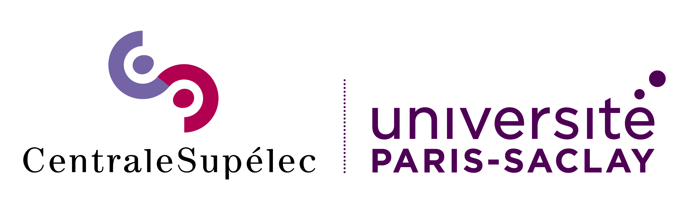

# Project_SDP: Sales Territory Optimization 




## **Context of project**
This project, conducted at CentraleSupélec within the Université Paris-Saclay, focuses on optimizing the assignment of sales representatives (SRs) to geographical territories for Pfizer Turkey. The initiative seeks to balance workload among SRs, minimize total travel distance, and manage disruptions caused by territory reassignments.

Pfizer Turkey's SRs are responsible for visiting medical doctors (MDs) within assigned territories called "bricks." Over time, changes in customer demand and geographical factors necessitate reorganization!

## **Authors**
- Rayane Bouaita
- Piere El Anati
- Gabriel Trier

## **Structure of Project**
The project is structured into four key steps, implemented through Python and GUROBI. The deliverables include code, visualizations, and reports organized in a hierarchical folder structure:

```
PROJECT_SDP
│
├── data/                  
│   ├── brick_rp_distances.csv
│   ├── bricks_index_values.csv
│   ├── distances.xlsx
│   └── results.csv
│
├── plots/                 # Visual representations of solutions
│   ├── pareto_solution_instance_4x22.png
│   ├── pareto_solution_instance_10x100_partially.png
│   └── example_assignation_[0.9,1.1]_5SRs.png
│   └── etc.png
|
│
├── README.md              # Documentation for the project
├── Step1-2.ipynb          # Code for Steps 1 and 2
├── Step3.ipynb            # Code for Step 3
└── Step4.ipynb            # Code for Step 4
```

---

## **Project Steps**
### **Step 1: Initial Assignment**
- Develop mono-objective linear optimization models for distance and disruption objectives.
- Solve the assignment problem for **22 bricks and 4 SRs** using GUROBI.
- Implement the epsilon-constraint scheme to compute **non-dominated solutions**.
- Visualize solutions with workload intervals \([0.8, 1.2], [0.85, 1.15], [0.9, 1.1]\).
- Scale the model to **100 bricks and 10 SRs** and propose visual representations.

### **Step 2: Model Extensions**
- Extend the model to **partially assign bricks** (e.g., shared assignments among SRs).
- Analyze scenarios with increased demand, requiring the addition of a new SR and determining their optimal office location.

### **Step 3: Bi-Objective Optimization**
- Allow modification of **center bricks** (SR offices).
- Formulate a bi-objective optimization model:
  - Minimize **total distance**.
  - Minimize **workload imbalance**.
- Redefine disruption as the **number of relocated offices** and solve for three objectives.

### **Step 4: Decision-Making Framework**
- Develop an **additive preference model** (UTA method) to support decision-making.
- Simulate decision-maker preferences and evaluate solutions for the three-objective problem.

---

## **How to Run the Code**
1. Clone or download the repository.
2. Execute the Jupyter notebooks step by step:
   - `Step1-2.ipynb`
   - `Step3.ipynb`
   - `Step4.ipynb`
---

## **Visual Examples**
### **Non-Dominated Solutions**
Example of some solutions obtained :


### **Assignments**
Example of some assignaiton proposed by Gurobi models during steps: 


---

